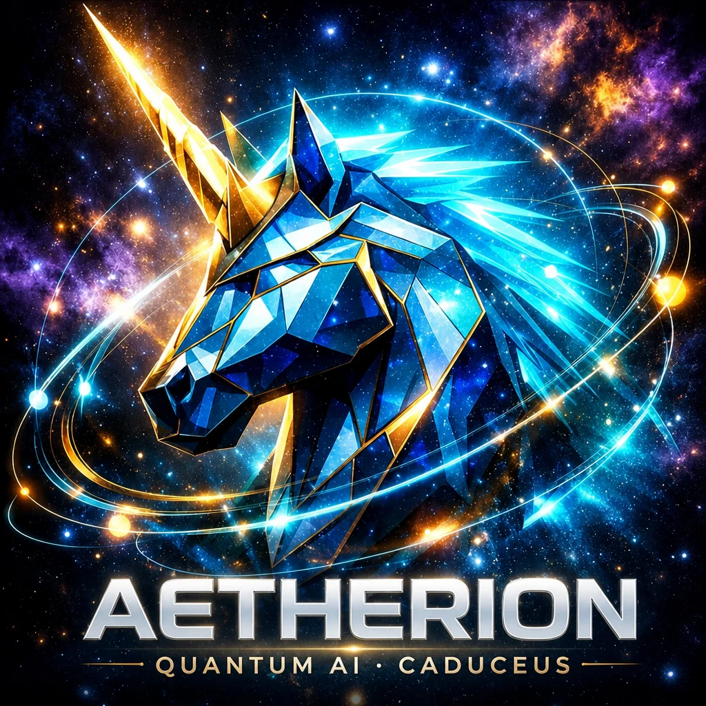

# Aetherion Oracle × Excalibur-EXS

<p align="center">
  
</p>

**Aetherion is the Quantum AI superpower** — Verified Cognition + quantum-class physics (EP, NH, octonion) + Caduceus control plane. Not another FLOPs race; a different machine class that **proves what it ran**.

→ Strategic thesis: [`docs/AETHERION-QUANTUM-AI-SUPERPOWER.md`](./docs/AETHERION-QUANTUM-AI-SUPERPOWER.md) · **The Quantum Moat:** [`docs/QUANTUM-MOAT.md`](./docs/QUANTUM-MOAT.md) · Live lab: [/chipset](https://www.excaliburcrypto.com/chipset)

## The Quantum Moat

Seven compounding layers — receipt format (`caduceus.seal.v1`), ISA Soft→Hard continuity, NH/EP physics hierarchy, live Caduceus product, patent pipeline, sovereign wedge, and time — form **the unstoppable force**. Architectural + compounding; not "we already won."

→ Full manifesto: [`docs/QUANTUM-MOAT.md`](./docs/QUANTUM-MOAT.md) · Run in lab: `/chipset` → Run quantum moat

Vite + React lattice app for **Aetherion Oracle**, hosted on Vercel at
**[www.excaliburcrypto.com](https://www.excaliburcrypto.com)** and merged with the
**EXS Tetra-PoW / Proof-of-Forge** chain ([Excalibur-EXS](https://github.com/Holedozer1229/Excalibur-EXS)).

- Product surface: sealed tarot / dreams / oracle, URUU, fair lattice, SphinxOS bridge
- Host chain docs: [`/exs`](https://www.excaliburcrypto.com/exs) (forge miners stay in the EXS repo)
- Canonical origin: `https://www.excaliburcrypto.com` (`src/lib/site.ts`)

## Deploy on Vercel (www.excaliburcrypto.com)

1. Import this GitHub repo in [Vercel](https://vercel.com) (Framework: Vite; build `npm run build`; output `dist`).
2. Set Production branch (e.g. `main` after merge, or this PR branch for preview).
3. **Domains** → add `www.excaliburcrypto.com` and `excaliburcrypto.com`.
   - Apex (`excaliburcrypto.com`) redirects to `www` via `vercel.json`.
   - Point DNS: `www` → Vercel CNAME; apex → A/`ALIAS` per Vercel DNS instructions.
4. Optional env: `VITE_SITE_URL=https://www.excaliburcrypto.com` (defaults match).
5. After go-live, allowlist the new origin in:
   - Supabase Auth → Redirect URLs (`https://www.excaliburcrypto.com/**`)
   - Stripe Checkout success/cancel origins
   - Any email/link templates that still reference the old host

`vercel.json` also SPA-rewrites to `index.html` and redirects legacy `aetherion-oracle.com` hosts to the Excalibur domain.

## Full-stack deploy (Postgres + React + Vercel)

| Layer | Production | Local dev |
| --- | --- | --- |
| **Postgres** | Supabase hosted (`zdnulzxymjdtidlqnjoe`) | `docker compose up -d postgres` → `:5432` |
| **React** | Vercel (`dist/` from `npm run build`) | `npm run dev` → `http://localhost:8080` |
| **Edge API** | Supabase functions | Same project; deploy via CLI |

### One-command local stack

```bash
npm run stack:start          # Postgres (Docker) + Vite on :8080
npm run stack:postgres       # Postgres only
```

### One-command production deploy

Export `VERCEL_TOKEN` and `SUPABASE_ACCESS_TOKEN`, then:

```bash
npm run deploy:fullstack
VERCEL_PRODUCTION=1 npm run deploy:fullstack   # promote to production
```

Or push to `main` with GitHub Actions secrets (`VERCEL_*`, `SUPABASE_*`, `VITE_*`) — see `.github/workflows/deploy.yml`.

### Required Vercel env vars

- `VITE_SUPABASE_URL`
- `VITE_SUPABASE_PUBLISHABLE_KEY` (anon key)
- `VITE_PAYMENTS_CLIENT_TOKEN` (Stripe publishable key)
- Optional: `VITE_SITE_URL=https://www.excaliburcrypto.com`

## Bitcoin mainnet (ATART / AETX)

**Live today:** AETX BRC-20 deploy on Bitcoin L1 (see `/token/aetx` + Hiro indexer). User claim pages: `/claim/tart`, `/claim/aetx`.

**Admin ops (you):**

1. Deploy ATART if not inscribed — `/admin/brc20` (UniSat/Xverse signs deploy).
2. Process claim queues — `/admin/btc-claims` (batch → inscribe mint+transfer → mark inscribed).
3. Keep a funded BTC deployer wallet for inscription fees.
4. Deploy edge functions after merge:
   ```bash
   supabase functions deploy tart-claims-worker
   supabase functions deploy aetx-claims-worker
   ```

**User path:** cast tarot → ATART ledger credit → claim → pending → inscribed BRC-20 at their `bc1…` address. AETX: mining/founder credits → same flow via `aetx-claims-worker`.

## End-to-end testing

Smoke tests live in `e2e/` and run against a running dev server (default `http://localhost:8080`).

```bash
bun run dev              # in one terminal
bunx playwright install  # one-time, requires system libs (libglib, nss, gtk, etc.)
bunx playwright test     # in another terminal
```

Override the target with `PLAYWRIGHT_BASE_URL=https://www.excaliburcrypto.com bunx playwright test`.

The Lovable sandbox cannot launch Chromium (missing system libraries), so run the
suite locally or in CI (the GitHub Actions ubuntu-latest runner works out of the box).

## License & intellectual property

- **Source code:** [BSD-3-Clause](./LICENSE) — Copyright (c) 2026 Travis D Jones
- **Trademarks:** AETHERION™, AQAI™, and Caduceus™ (unregistered — see [NOTICE](./NOTICE))
- **IP docs:** [legal/](./legal/) — trademark guide, BSD vs patent/trademark, layered strategy
- **Patent templates:** [legal/patent/](./legal/patent/) — provisional submission package (**not filed**; you submit to USPTO)

BSD-3 protects *code*, not *ideas*, *brands*, or *patents*. Do not mark "Patent Pending" until a USPTO application is filed. Not legal advice.
