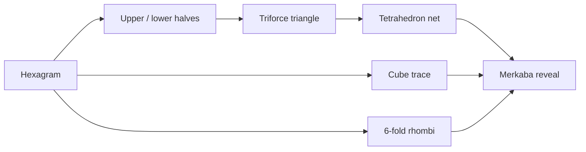

# Hexagram → Tetrahedron → Merkaba

Sacred geometry construction for the Aetherion Caduceus speculative lane.  
Interactive lab: [`/caduceus/speculative/hexagram-tetra`](/caduceus/speculative/hexagram-tetra)

## Hidden object

**The concealed solid is the Merkaba (stellated octahedron)** — two interlocking regular tetrahedra whose 2D orthographic shadow is the hexagram (Star of David).

Aliases: star tetrahedron, interlocking tetrahedra, 3D hexagram.  
Metatron's Cube contains this same structure as its inner kernel.

---

## Construction pipeline



---

## Step 0 — Hexagram

Two equilateral triangles share the origin:

| Triangle | Pole vertices (degrees) |
|----------|-------------------------|
| Ascending | 90°, 210°, 330° |
| Descending | 270°, 30°, 150° |

Outer circumradius **R**. Six vertices on a circle.

```
           ▲ (0, R)
          / \
         /   \
    ◄───●─────●───►  inner width 2R/√3
         \   /
          \ /
           ▼ (0, −R)
```

---

## Step 1 — Bisect into halves

Horizontal bisector **y = 0** cuts the star.

Each half is an **equilateral triangle**:

- Upper apex: `(0, R)`
- Base corners: `(±R/√3, 0)`
- Edge length: `2R/√3`

The lower half mirrors through the origin.

---

## Step 2 — Triforce assembly

Copy one half-triangle three times. Rotate by **120°** and translate so the three apices meet at the center — the classic **tripod / triforce** layout.

The outer boundary is a larger equilateral triangle whose vertices are the three outward-facing base midpoints.

---

## Step 3 — Tetrahedron net

Four congruent equilateral faces (each matching the half-triangle edge) fold into a **regular tetrahedron**.

```
        △
       / \
      △───△
       \ /
        △
```

Edge length **a = 2R/√3**.  
Four 3D vertices (one common model, centered):

```
(±s, ±s, ±s)  with  s = a/√2
```

---

## Step 4 — Six-fold division

From the center, draw radii to each outer vertex → **six 60° wedges**.

Connecting inner hexagon vertices yields **six rhombi** (diamonds) around a central hexagon — the crystalline lattice of the star.

---

## Step 5 — Cube trace

The hexagram is the **orthographic shadow of a cube**:

- Six outer star tips ↔ six cube corners seen from a diagonal
- Inner hexagon ↔ equatorial square of the cube projection

This is the same family of figures as **Metatron's Cube** (13 circles / lines connecting cube diagonals).

---

## Step 6 — Hidden object reveal

Hold three constructions simultaneously:

1. **Fold** the tetrahedron net (Step 3).
2. **Read** the hexagram as cube shadow (Step 5).
3. **Spin** the six-fold lattice (Step 4).

The consistent 3D solid is the **Merkaba**:

- Two regular tetrahedra, dual to each other
- 8 vertices, 8 faces (stellated octahedron)
- Projects to the 2D hexagram when viewed along a 4-fold axis

```
       /\          Two tetrahedra
      /  \         interpenetrate:
     /____\        one apex up, one down.
      \  /
       \/
```

---

## Coordinate reference

Implementation: `src/lib/sacredGeometry/hexagramTetrahedron.ts`

| Function | Returns |
|----------|---------|
| `hexagramVertices(R)` | 6 outer tips |
| `upperHalf(R)` / `lowerHalf(R)` | Bisected equilateral triangles |
| `triforceLayout(R)` | 3 translated half-triangles |
| `tetrahedronNet(R)` | 4 face paths (2D net) |
| `tetrahedronVertices3D(a)` | 4 3D vertices |
| `sixRhombi(R)` | 6 diamond quads |
| `cubeVertices3D(R)` | 8 cube corners |
| `merkabaVertices3D(a)` | 8 stellated-octahedron corners |
| `hexagramSvgLayers(R)` | SVG path strings for the lab |

---

## Tetra-PoW attestation

Each construction step index `0…6` binds a deterministic Tetra-PoW lane hash:

```
hexagram-tetra:v1|EXCAL Tetra-PoW|EXCAL|step:N|<id>|tip:<hash>|hidden:Merkaba
```

See `attestationForStep(stepIndex, tipHash)` in the lib module.

---

## ASCII summary

```
HEXAGRAM ──bisect──► HALF △ ──×3──► TRIFORCE ──×4 fold──► TETRAHEDRON
    │                                                      │
    ├── 6 radii ──► RHOMBI                                 │
    └── shadow ──► CUBE TRACE ──────────────┬──────────────┘
                                            ▼
                                      MERKABA ★
                               (stellated octahedron)
```

---

*Speculative geometry — metaphor for Caduceus dual-tetra symmetry, not physical proof.*
