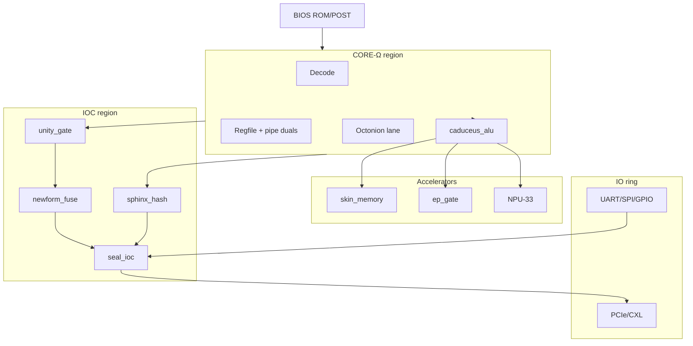

# AQAI chipset floorplan — ASCII + block diagram

**Die codename:** `caduceus-die-v1` · **Full SOVEREIGN die stub:** ~142 mm²  
**Honesty:** floorplan is a design target — not extracted from GDSII.

See also: [09-physical-design-complete.md](../docs/09-physical-design-complete.md) · [block-inventory.yaml](block-inventory.yaml)

---

## 1. Top-down floorplan (ASCII)

```
                         NORTH (PCIe / CXL IO ring)
    ┌──────────────────────────────────────────────────────────────────┐
    │ ▓▓▓▓▓▓▓▓▓▓▓▓▓▓▓▓▓▓▓▓▓▓▓▓▓▓▓▓▓▓▓▓▓▓▓▓▓▓▓▓▓▓▓▓▓▓▓▓▓▓▓▓▓▓▓▓▓▓▓▓▓▓▓▓▓▓▓▓ │
    │ ▓  IO-PCIE          IO-CXL              ref_clk / bumps        ▓ │
    ├──────────┬───────────────────────────────────────┬───────────────┤
    │          │                                       │               │
 W  │ SKIN     │  ┌─────────────────────────────────┐  │  NPU-33       │  E
 E  │ MEMORY   │  │         CORE-Ω (north)          │  │  PoM          │  A
 S  │          │  │  decode · regfile · INT-ALU     │  │  systolic     │  S
 T  │ NH tiles │  │  octonion · Sphinx pipe         │  │               │  T
    │ SK-CSR   │  ├─────────────────────────────────┤  │               │
    │          │  │      CADUCEUS-ALU (center)      │  │  IOC          │
    │ ~28mm²   │  │   braid · twin-serpent probe    │  │  seal_ioc     │
    │ stub     │  ├─────────────────────────────────┤  │  unity_gate   │
    │          │  │    Anubis pipe (core south)     │  │  sphinx_hash  │
    │          │  └─────────────────────────────────┘  │  newform_fuse │
    │          │                                       │  ~12mm² stub  │
    ├──────────┴───────────────────┬───────────────────┴───────────────┤
    │         EPX (south)          │         CSR hub                   │
    │  ep_gate · PT phases         │  twin-serpent @ 0x2000_0000       │
    │  EP-CSR @ 0x2000_0100        │                                   │
    ├──────────────────────────────┴───────────────────────────────────┤
    │ ▓▓ UART · SPI · GPIO · JTAG · straps · IO-PAD-RING (ESD) ▓▓▓▓▓▓▓▓ │
    └──────────────────────────────────────────────────────────────────┘
                         SOUTH / EAST IO ring

    NW corner: BIOS-ROM · POST · firmware_stub
    NE corner: clk_island — PLL core / skin / seal / phonon / rst_sync
    SE corner: DFT-TAP (scan / MBIST)
```

**Legend:** `▓` = IO pad ring · boxed regions = core macros · sizes are **stubs**.

---

## 2. Layer stack (conceptual)

```
┌─────────────────────────────────────┐  ← Metal top (power mesh)
│  Signal routing (core ↔ IOC ↔ IO)   │
├─────────────────────────────────────┤
│  Block macros (see inventory)       │
├─────────────────────────────────────┤
│  PDN (PD_CORE · PD_SKIN · PD_IOC)   │
├─────────────────────────────────────┤
│  Substrate / bumps                  │
└─────────────────────────────────────┘
```

---

## 3. Block diagram (dataflow)



---

## 4. Region utilization (stub)

| Region | Area stub | Utilization target |
|--------|-----------|-------------------|
| core_north + center + south | 38 mm² | 68% |
| npu_east | 22 mm² | 72% |
| skin_west | 28 mm² | 65% |
| epx_south | 7 mm² | 60% |
| ioc_east | 10 mm² | 70% |
| bios + clk + dft | 4 mm² | 55% |
| io_ring | 26 mm² | 50% (SerDes limited) |
| **Total** | **~142 mm²** | **~65% avg** |

---

## 5. SKU die size comparison

```
EDGE (~48mm²)          CLOUD (~98mm²)              SOVEREIGN (~142mm²)
┌─────────────┐        ┌──────────────────┐        ┌────────────────────────┐
│ CORE+IOC    │        │ + SKIN + EPX     │        │ + full IO + newform    │
│ NPU BIOS    │        │ + SPHINX PCIe    │        │ + all axioms on die    │
└─────────────┘        └──────────────────┘        └────────────────────────┘
```

G3 MPW v1: subset maps to EDGE P0 (CORE + seal_ioc) — full floorplan above is the **target** SOVEREIGN product.

---

## 6. Files in this pack

| File | Purpose |
|------|---------|
| `floorplan-aqai-chipset.md` | This document |
| `block-inventory.yaml` | 39-row inventory + SKU map |
| `pad-ring.md` | Bump / pad specification |
| `../docs/09-physical-design-complete.md` | Master PD document |
